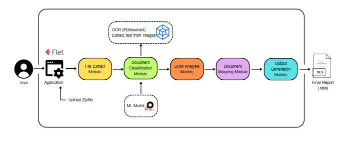
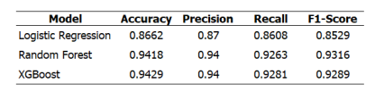

# ModelAI – Machine Learning Document Classification

## 📌 Project Overview

This project focuses on developing a Machine Learning model for automatic document classification.

The system is designed to classify documents into predefined categories based on extracted text and document-related features. The goal is to reduce manual document sorting and improve the efficiency of document management workflows.

This project was developed as part of a cooperative education / internship project.

---

## 🎯 Objective

The main objectives of this project are:

* Automatically classify documents into predefined categories.
* Reduce the time required for manual document classification.
* Apply Machine Learning techniques to real-world document processing.
* Develop a reusable model for document classification.

---

## 🏗️ Machine Learning Pipeline


## 🤖 Machine Learning Approach

The project uses a combination of text processing and Machine Learning techniques.

### Text Processing

* Text extraction from documents
* OCR for extracting text from image-based documents
* Text preprocessing
* TF-IDF Vectorization
* N-gram features

### Feature Engineering

The model uses multiple types of features:

* TF-IDF features
* Keyword-based features
* Metadata features
* File extension information
* File size information

These features are combined to improve the model's ability to distinguish between different document categories.

---

## 🌳 Machine Learning Model

The primary classification model used in this project is:

**Random Forest Classifier**

The model was selected due to its ability to handle high-dimensional feature spaces and its robustness for classification tasks.

The training process includes:

* Stratified 5-Fold Cross-Validation
* Class balancing
* Hyperparameter configuration
* Model evaluation

---

## 📂 Document Categories

The model is designed to classify documents into categories such as:

* Assembly Drawing
* BOM
* CAD
* Circuit Schematic Drawing
* Gerber
* PCB Fabrication Drawing
* Test Specification
* Work Instruction
* Other Document

---

## 📊 Model Evaluation

The model performance is evaluated using the following metrics:

* Accuracy
* Precision
* Recall
* F1-Score
* Confusion Matrix

### Evaluation Results


---

## 📁 Project Structure

```text
ModelAI/
│
├── README.md
│
├── models/
│   ├── model.joblib
│   └── vectorizer.joblib
│
├── src/
│   ├── predict.py
│   ├── preprocess.py
│   └── features.py
│
├── training/
│   ├── train_model.py
│   └── evaluate_model.py
│
├── results/
│   └── confusion_matrix.png
│
└── requirements.txt
```

> The project structure may vary depending on the final implementation.

---

## 🚀 How It Works

The general prediction process is:

1. Input a document into the system.
2. Extract text from the document.
3. Apply OCR when necessary.
4. Preprocess the extracted text.
5. Transform text into TF-IDF features.
6. Combine text-based, keyword-based, and metadata features.
7. Pass the features to the trained Machine Learning model.
8. Predict the document category.

---

## 💻 Technologies

* Python
* Scikit-learn
* Pandas
* NumPy
* TF-IDF
* Random Forest
* OCR
* Joblib

---

## 🔒 Data Privacy

The dataset used for model training may contain confidential or company-related information and is therefore not included in this repository.

Only the necessary model files and project-related documentation are provided for demonstration purposes.

---

## 📌 Project Status

This repository contains the Machine Learning model and supporting documentation developed during a cooperative education / internship project.

The repository is intended to demonstrate the Machine Learning workflow and technical approach used in the project.

---

## 👨‍💻 Author

**Manonat Thanachotipongsa**

Machine Learning / AI Enthusiast

GitHub: https://github.com/pungseon
